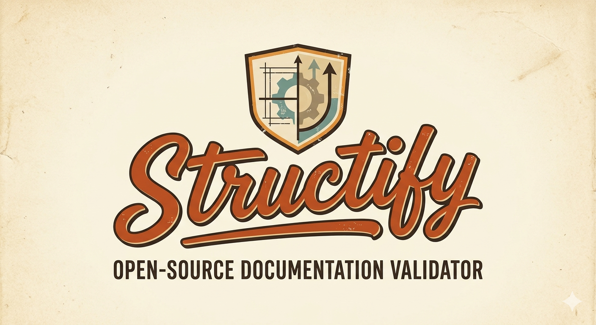

# Structify
<p align="center">
  
</p>

<div align="center">

### Documentation should be consistent.

An open-source project focused on helping teams organize, standardize, and maintain high-quality documentation.

</div>

---

## About

Structify is an open-source project dedicated to improving the way documentation is structured and maintained.

As projects grow, documentation often becomes fragmented, inconsistent, and difficult to navigate. Structify aims to solve this problem by providing tools that help create, validate, and standardize documentation across different platforms and workflows.

This repository contains the source code for the official Structify website, which serves as the public entry point for the project.

---

## Purpose of the Website

The website acts as the central hub for the Structify ecosystem.

It provides:

* Project information
* Documentation access
* Roadmap updates
* Release announcements
* Download links
* Open-source transparency
* Community resources

---

## Vision

Structify's long-term goal is to become a universal documentation standardization platform.

The project focuses on:

* Consistency
* Maintainability
* Transparency
* Local-first principles
* Open-source development

Rather than generating documentation, Structify aims to help teams maintain clear and structured documentation standards.

---

## Documentation

Technical documentation is maintained separately from this README.

For detailed documentation, please refer to:

```text
/docs
```

---

## Roadmap

The project is currently in active development.

Future milestones include:

* Documentation platform integrations
* Template management
* Validation engine
* Automation workflows
* Intelligent document analysis

---

## Open Source

Structify is developed as an open-source project with transparency as a core principle.

The source code, development process, roadmap, and project decisions are publicly available.

---

## License

This project is licensed under the terms of the license included in this repository.
